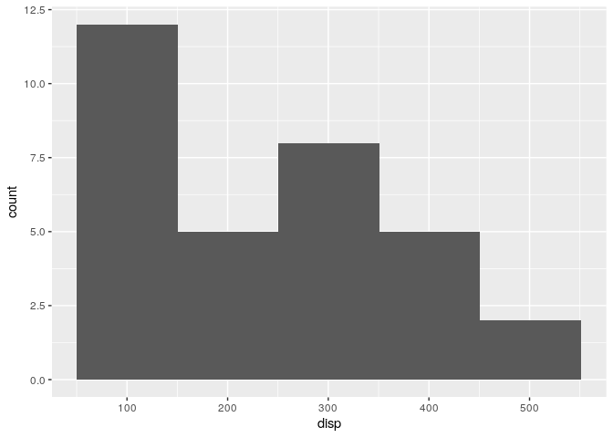

<!-- README.md is generated from README.Rmd. Please edit that file -->

# smmr

<!-- badges: start -->

<!-- badges: end -->

Sign and Mood’s Median Test in R

## Installation

You can install `smmr` from [GitHub](https://github.com/) with:

``` r
# install.packages("devtools")
devtools::install_github("nxskok/smmr")
```

## The sign test

This is a test for the population **median** from a single sample. It
can be used when testing for a mean is problematic, for example when the
sample indicates that the population distribution is skewed, and
inference for the mean does not make sense.

Consider the `disp` values from the `mtcars` data set:

``` r
library(tidyverse)
#> ── Attaching packages ────────────────────────────────────────────────────────────────────────────────────────────── tidyverse 1.3.0 ──
#> ✓ ggplot2 3.3.0           ✓ purrr   0.3.4      
#> ✓ tibble  3.0.1           ✓ dplyr   0.8.99.9002
#> ✓ tidyr   1.0.2           ✓ stringr 1.4.0      
#> ✓ readr   1.3.1           ✓ forcats 0.5.0
#> ── Conflicts ───────────────────────────────────────────────────────────────────────────────────────────────── tidyverse_conflicts() ──
#> x dplyr::filter() masks stats::filter()
#> x dplyr::lag()    masks stats::lag()
ggplot(mtcars, aes(x=disp)) + geom_histogram(bins=5)
```



This distribution is skewed to the right, and we might be hesitant about
using a t-test for the mean.

Could the median `disp` value be 150?

``` r
library(smmr)
sign_test(mtcars, disp, 150)
#> $above_below
#> below above 
#>    12    20 
#> 
#> $p_values
#>   alternative   p_value
#> 1       lower 0.9449079
#> 2       upper 0.1076636
#> 3   two-sided 0.2153271
```

The two-sided P-value is 0.215, so there is no evidence that the
population median differs from 150. The output also permits an
assessment of whether the median is less than 150 (P-value 0.945) or
greater than 150 (P-value 0.108). The output also includes a count of
the number of data values above (20) and below (12) the hypothesized
median. This is not an uneven enough split to be able to reject a null
hypothesis that the population median is 150.

## Confidence interval for median

A 95% confidence interval for the population median can be found by
taking all the population medians that would not be rejected at alpha of
1-0.95=0.05:

``` r
ci_median(mtcars, disp)
#> [1] 140.8025 303.9975
```

The null median of 150 that we failed to reject is (predictably) inside
this confidence interval.

The sign test and its corresponding confidence interval can also be used
with matched-pair data, by applying them to the one sample of
differences, testing a null median difference of zero.

## Comparing two or more than two medians

To compare several medians (testing the null hypothesis that they are
all equal, against the alternative that they are not all equal), we can
use Mood’s median test. For example, in `mtcars`, is the median `disp`
the same for all numbers of cylinders?

``` r
median_test(mtcars, disp, cyl)
#> $table
#>      above
#> group above below
#>     4     0    11
#>     6     2     5
#>     8    14     0
#> 
#> $test
#>        what        value
#> 1 statistic 2.628571e+01
#> 2        df 2.000000e+00
#> 3   P-value 1.959430e-06
```

Definitely not, with P-value 0.00000196. To find which numbers of
cylinders have different median values of `disp`, we can run Mood’s
median tests for each pair of groups, adjusting for multiple testing
using Bonferroni:

``` r
pairwise_median_test(mtcars, disp, cyl)
#> # A tibble: 3 x 4
#>      g1    g2    p_value adj_p_value
#>   <dbl> <dbl>      <dbl>       <dbl>
#> 1     4     6 0.000713    0.00214   
#> 2     4     8 0.00000273  0.00000818
#> 3     6     8 0.00103     0.00310
```

All three numbers of cylinders have different median `disp` values, the
largest of the adjusted P-values being 0.003. A look back at the table
of values above and below in the output for `median_test` reveals that
all 11 of the 4-cylinder cars have a `disp` less than the median of all
the cars, while all 14 of the 8-cylinder cars have a `disp` value
*greater* than this overall median.

## Comment

The sign test and Mood’s median test are often derided as lacking power
compared to the signed rank, rank-sum and Kruskal-Wallis tests. However,
the latter three tests come with extra assumptions: the signed-rank test
assumes a symmetric distribution, and the other two tests assume equal
spreads among the groups. When we have doubts about using a t-test or an
ANOVA, we may well doubt these assumptions as well, and I think it is
better to use a test that does not make these assumptions at all.
